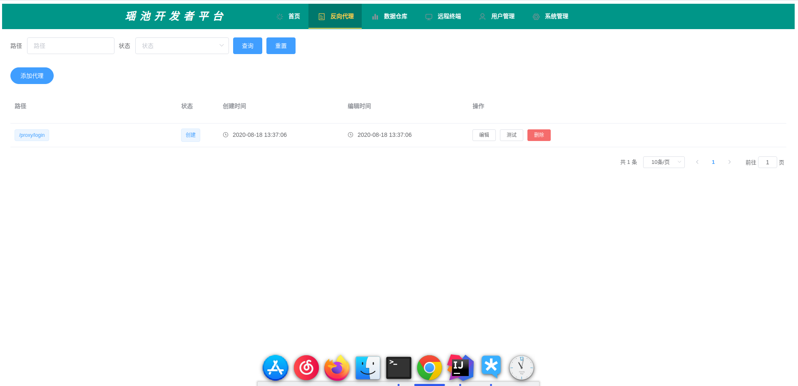
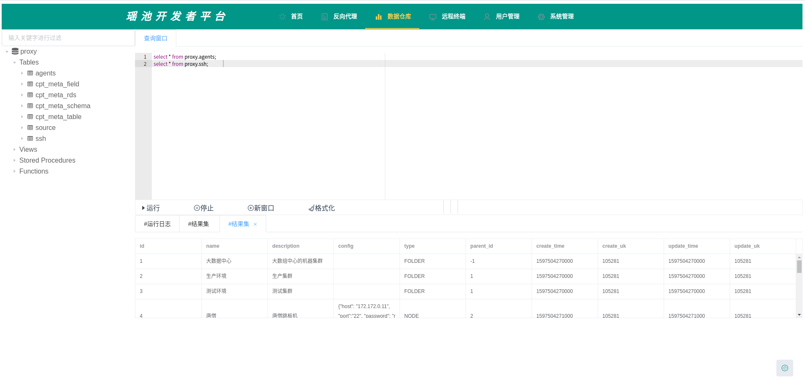
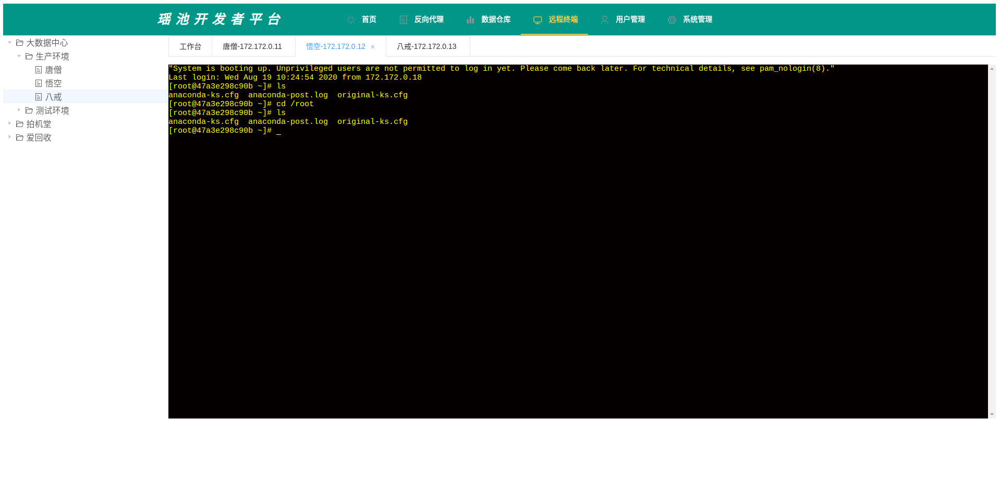

# 瑶池开发者平台
# 体验地址(开源不易，为了大家都能有一个好的体验，不要乱搞我的服务器和数据库哦，谢谢。)
    http://121.196.27.184:8112/

# 项目截图

# 首页
 

# 反向代理
 

# 数据仓库
 

# 数据仓库
 

## 运行一个mysql
    sudo docker run -itd -p 3306:3306 --name mysql -v /data/mysql/conf:/etc/mysql/conf.d -v /data/mysql/logs:/logs -v /data/mysql/data:/var/lib/mysql -e MYSQL_ROOT_PASSWORD=root -d mysql:latest
    sql在jade-pool-app的resource文件夹下面

#  下面这些操作是因为我只有一台服务器，所以，使用docker创建的容器来模拟ssh登录.
# 运行一个容器
    docker run -itd  --privileged --name abc -p 2200:22 centos /usr/sbin/init
    docker exec -it abc  /bin/bash

# 安装password
    yum search passwd
    yum install passwd.x86_64
    passwd root

# 安装openssh
yum -y install openssh*

# 安装systemctl
    yum list | grep initscripts
    yum install initscripts.x86_64 -y
    vi /etc/ssh/sshd_config

    RSAAuthentication yes #启用 RSA 认证
    PubkeyAuthentication yes #启用公钥私钥配对认证方式
    AuthorizedKeysFile .ssh/authorized_keys #公钥文件路径（和上面生成的文件同）
    PermitRootLogin yes #root能使用ssh登录
# 重启ssh
    systemctl restart sshd
# 开机自启动
    chkconfig sshd on
# 安装network命令 ifconfig
    yum install net-tools -y
# 退出容器后把容器提交为镜像
    docker commit -m 'openssh' -a 'yule.zhang' abc centos-ssh:latest

# 配置跨主机容器访问
    docker network create --subnet=172.172.0.0/24 docker-br0
    备注：这里选取了172.172.0.0网段，也可以指定其他任意空闲的网段，docker-br0为自定义网桥的名字，可自己任意取名。
    注意：这里子网掩码要使用255.255.255.0也就是IP后面的那个24,因为后面要使用iptables配置路由表,我之前使用255.255.0.0 无法配置.所以这里配置成24.

    创建网桥之后,使用ifconfig查看 会多出一个网桥,该网桥在docker启动或者重启之后,会自动显示出来。永久的,可以使用docker network rm docker-br0 移除网桥。

# 在要访问容器的宿主机上添加路由表（这个亲测可以不要，反正我没加这个，也没成功过）
    # ip route add 172.172.1.0/24 via ECS(IP) dev eno16777736(本机网卡)

# 运行7个容器作为测试(先在jade-pool的容器中执行ssh-keygen,一路回车生成密钥，加入到主机的新人中，然后这七个容器挂载这个目录，批量授信）
    docker run -itd --net docker-br0 --ip 172.172.0.11 --name abc -v /root/.ssh:/root/.ssh -p 20001:22 centos-ssh /usr/sbin/sshd -D
    docker run -itd --net docker-br0 --ip 172.172.0.12 --name abd -v /root/.ssh:/root/.ssh -p 20002:22 centos-ssh /usr/sbin/sshd -D
    docker run -itd --net docker-br0 --ip 172.172.0.13 --name abe -v /root/.ssh:/root/.ssh -p 20003:22 centos-ssh /usr/sbin/sshd -D
    docker run -itd --net docker-br0 --ip 172.172.0.14 --name abf -v /root/.ssh:/root/.ssh -p 20004:22 centos-ssh /usr/sbin/sshd -D
    docker run -itd --net docker-br0 --ip 172.172.0.15 --name abg -v /root/.ssh:/root/.ssh -p 20005:22 centos-ssh /usr/sbin/sshd -D
    docker run -itd --net docker-br0 --ip 172.172.0.16 --name abh -v /root/.ssh:/root/.ssh -p 20006:22 centos-ssh /usr/sbin/sshd -D
    docker run -itd --net docker-br0 --ip 172.172.0.17 --name abi -v /root/.ssh:/root/.ssh -p 20007:22 centos-ssh /usr/sbin/sshd -D

# 测试ssh 记住，如果使用容器的IP的话，要使用22端口，如果使用宿主机登录的话才能使用20001端口，弯路
    ssh root@172.172.0.11 -p 22

# 部署容器
    cd /root
    mkdir code
    git init
    git remote add origin https://github.com/ZhangLe1993/jade-pool.git
    git checkout -b master
    git pull origin master
    git fetch
    git branch --set-upstream-to=origin/master master

# maven
    wget https://mirrors.tuna.tsinghua.edu.cn/apache/maven/maven-3/3.6.3/binaries/apache-maven-3.6.3-bin.tar.gz

# 快速使用（镜像已经上传到docker hub）
    使用同一个网络桥，让容器之间可以互相ssh登录
    docker run -itd --net docker-br0 --ip 172.172.0.18 --name jade-pool -e active="dev" -p 8112:8112 -v /root/code:/root/code -v /root/ws:/root/ws -v /root/.m2:/root/.m2 -v /root/.ssh:/root/.ssh zhangyule1993/jade-pool:v1.0.0

# docker批量重启
    docker stop $(docker ps -a |grep ab| awk '{ print $1}' | tail -n +2)
    docker rm $(docker ps -a |grep ab| awk '{ print $1}' | tail -n +2)
    docker start $(docker ps -a | awk '{ print $1}' | tail -n +2)

